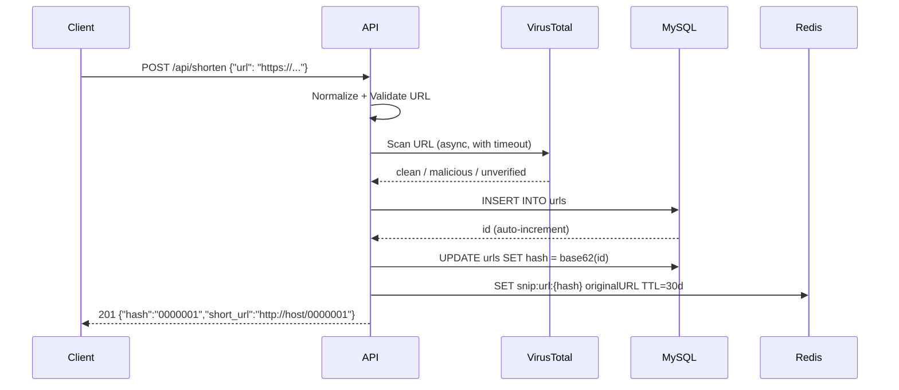
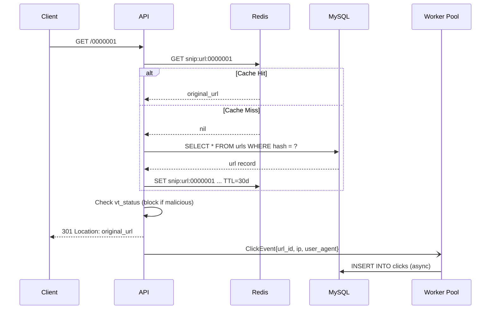
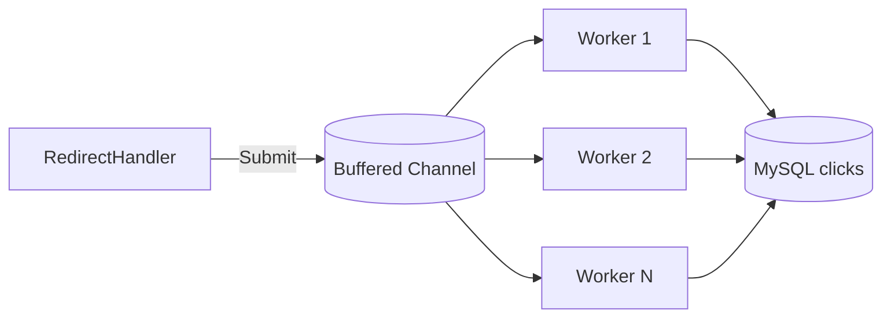

# ✂️ Snip

A production-ready URL shortener API built with Go, featuring Redis cache-aside, async analytics via goroutines, multi-layer security, and graceful shutdown — designed as a high-concurrency microservice demonstration.


[](https://github.com/devpedrois/snip/actions/workflows/ci.yml)

---

## 📋 Table of Contents

- [About](#-about)
- [Architecture](#-architecture)
- [Stack](#-stack)
- [Security](#-security)
- [Prerequisites](#-prerequisites)
- [Getting Started](#-getting-started)
- [Testing](#-testing)
- [API Reference](#-api-reference)
- [Environment Variables](#-environment-variables)
- [Project Structure](#-project-structure)
- [Architecture Decisions](#-architecture-decisions)
- [Contributing](#-contributing)
- [License](#-license)

---

## 🎯 About

**Snip** demonstrates idiomatic Go patterns in a real-world scenario:

- Goroutines and channels for non-blocking analytics ingestion
- Cache-aside pattern with Redis in front of MySQL
- Context propagation from HTTP handler down to database layer
- Graceful shutdown draining in-flight events before exit
- Structured logging with `log/slog` (JSON in production, text in development)
- Multi-layer security: rate limiting, URL validation, VirusTotal scanning, IP anonymization

The goal is a codebase that a new Go developer can read end-to-end and understand every decision.

---

## 🏗️ Architecture

### POST /api/shorten — Create Short URL



### GET /{hash} — Redirect



### Analytics — Async Click Ingestion



---

## 🛠️ Stack

| Layer | Technology |
|---|---|
| Language | Go 1.22+ |
| HTTP Router | `chi` v5 |
| Database | MySQL 8 |
| MySQL Driver | `go-sql-driver/mysql` |
| Migrations | `golang-migrate/migrate` |
| Cache | Redis 7 |
| Redis Client | `redis/go-redis` v9 |
| Logging | `log/slog` (stdlib) |
| Configuration | `joho/godotenv` + env vars |
| Testing | `testing` + `testify` |
| Integration Tests | `testcontainers-go` |
| Containerization | Docker + Docker Compose |

---

## 🔒 Security

URL shorteners are a well-known attack vector. Snip implements security in layers, from HTTP transport to data storage.

### Rate Limiting

Every endpoint has an independent token-bucket rate limiter, keyed by client IP. `X-Forwarded-For` is only trusted when the source IP is listed in `TRUSTED_PROXIES`.

| Endpoint | Limit |
|---|---|
| `POST /api/shorten` | 5 req/min |
| `GET /{hash}` | 60 req/min |
| `GET /api/analytics/{hash}` | 30 req/min |
| `POST /api/report/{hash}` | 3 req/min |
| `GET /health` | unlimited |

Exceeded limits return `HTTP 429` with a `Retry-After: 60` header. Inactive IP entries are purged every 5 minutes.

### Security Headers

Applied globally to every response:

```
X-Content-Type-Options: nosniff
X-Frame-Options: DENY
X-XSS-Protection: 1; mode=block
Referrer-Policy: no-referrer
Content-Security-Policy: default-src 'none'
Cache-Control: no-store, no-cache, must-revalidate  (redirect only)
```

### HTTP Server Hardening

```go
ReadTimeout:       10s
ReadHeaderTimeout: 5s   // Slowloris mitigation
WriteTimeout:      30s
IdleTimeout:       60s
MaxHeaderBytes:    1MB
```

- Request body capped at 1MB (`HTTP 413` if exceeded).
- `Content-Type: application/json` enforced on all POST endpoints (`HTTP 415` otherwise).
- `json.Decoder` uses `DisallowUnknownFields()` — unknown fields return `HTTP 400`.
- Request IDs are always generated internally. `X-Request-ID` from the client is ignored to prevent log injection via header spoofing.
- Panic recovery never exposes stack traces in production. Only `{"error":"internal server error","code":"ERR_INTERNAL"}` is returned.

### URL Validation Pipeline

Every URL submitted to `POST /api/shorten` passes through a sequential validation chain, ordered from cheapest to most expensive:

| Step | Check | Error code |
|---|---|---|
| 1 | Length: empty or > 2048 chars | `ERR_INVALID_URL` |
| 2 | Parse: must be a valid URL | `ERR_INVALID_URL` |
| 3 | Scheme: only `http` / `https` | `ERR_INVALID_URL` |
| 4 | Userinfo: `user:pass@host` rejected | `ERR_URL_HAS_CREDENTIALS` |
| 5 | Self-reference: cannot point to Snip itself | `ERR_URL_SELF_REF` |
| 6 | SSRF: private/link-local/cloud metadata IPs blocked | `ERR_URL_PRIVATE_IP` |
| 7 | Homograph/IDN: Unicode host differing from ASCII form rejected | `ERR_URL_HOMOGRAPH` |
| 8 | Blocklist: known shorteners blocked (bit.ly, tinyurl.com, t.co...) | `ERR_URL_BLOCKED` |

**SSRF protection** covers: `10.0.0.0/8`, `172.16.0.0/12`, `192.168.0.0/16`, `127.0.0.0/8`, `169.254.0.0/16` (AWS/GCP/Azure metadata endpoint), and IPv6 equivalents.

**URL normalization** runs before validation and before storage: lowercase scheme and host, strip fragments, strip default ports, strip lone trailing slash. This enables correct deduplication — `HTTP://EXAMPLE.COM/` and `http://example.com` are the same URL.

**CRLF injection** in the `Location` header is prevented by stripping `\r`, `\n`, `\t`, and `\x00` from any URL before it is written to a response header. URLs fetched from Redis are also re-validated for `http`/`https` scheme before redirect — if the cached value fails, the key is deleted and a `500` is returned.

### VirusTotal Integration

Before a new URL is stored, Snip submits it to the [VirusTotal API v3](https://www.virustotal.com/gui/home/url) for malware scanning.

```
NormalizeURL → ValidateURL → DeduplicationCheck → VirusTotalScan → store / reject
```

| Scan result | Response |
|---|---|
| `clean` | `201 Created` — normal response |
| `malicious` | `422 Unprocessable Entity` with engine count and VT permalink |
| `unverified` (timeout / VT unavailable) | `201 Created` with `X-Scan-Status: unverified` header |

A URL is classified as malicious when `stats.malicious >= VT_MIN_POSITIVES` (default: 2). Scan results are cached in Redis (`snip:vt:{sha256(url)}`) for 24 hours to avoid redundant API calls.

**The scan never blocks a shorten request.** Any VT failure (network error, rate limit, timeout) degrades gracefully to `unverified` — the URL is saved and served normally while a background re-scan runs later.

Disable VT with `VT_ENABLED=false` — a `NoopScanner` takes over, always returning `clean`. Tests never make real HTTP calls to VirusTotal.

### Background Re-scan

A `Rescanner` goroutine runs every `VT_RESCAN_INTERVAL_HOURS` (default: 6h). It fetches all `unverified` URLs, submits each one to VirusTotal with a 20-second delay between requests to respect API quotas, and updates the stored status.

If a previously-unverified URL comes back `malicious`:
- `vt_status` is updated in MySQL.
- The Redis cache key (`snip:url:{hash}`) is deleted immediately.
- The redirect endpoint will now return `HTTP 403` for that hash.

The re-scanner respects `context.Done()` between URLs to participate in graceful shutdown.

### Redirect Blocking

`GET /{hash}` checks `vt_status` after resolving the URL. If the status is `malicious`, the redirect is blocked with `HTTP 403`:

```json
{
  "error": "this url has been flagged as malicious and is no longer available",
  "code": "ERR_URL_MALICIOUS",
  "report": "https://www.virustotal.com/gui/url/..."
}
```

### Abuse Report Endpoint

`POST /api/report/{hash}` allows users to flag URLs:

```json
{"reason": "phishing"}
```

Valid reasons: `phishing`, `malware`, `spam`, `illegal`, `other`.

- The same IP cannot report the same URL twice (`UNIQUE (url_id, reporter_ip)` constraint).
- Reporter IP is anonymized before storage (see Privacy section).
- When a URL accumulates `REPORT_AUTO_BLOCK_THRESHOLD` reports (default: 5) from distinct IPs, it is automatically set to `malicious` and its Redis cache key is deleted.

### Privacy

- **IP anonymization**: IPv4 last octet zeroed (`192.168.1.45` → `192.168.1.0`). IPv6 last 8 bytes zeroed (prefix `/64` kept). Applied to both `clicks` and `url_reports` before any INSERT.
- **Click data retention**: A background goroutine deletes clicks older than `ANALYTICS_RETENTION_DAYS` (default: 90) in batches of 10,000 rows every 24 hours.
- **Log sanitization**: User-Agent, IP, and any request-derived value is stripped of ASCII control characters (0–31, 127) before logging to prevent log injection.
- **No full URL logging**: Only `hash` and URL `host` appear in logs. The full `original_url` is never logged.

### Docker Hardening

The API container runs as a non-root user with a read-only filesystem:

```dockerfile
RUN addgroup -S appgroup && adduser -S appuser -G appgroup
USER appuser
```

```yaml
security_opt:
  - no-new-privileges:true
read_only: true
tmpfs:
  - /tmp
```

---

## 📦 Prerequisites

| Tool | Version | Purpose |
|---|---|---|
| Docker | 24+ | Run containers |
| Docker Compose | v2+ | Orchestrate services |
| Make | any | Run Makefile targets |
| Go | 1.22+ | Local development and tests |

---

## 🚀 Getting Started

### 1. Clone the repository

```bash
git clone https://github.com/devpedrois/snip.git
cd snip
```

### 2. Configure environment

```bash
cp .env.example .env
```

Defaults work out of the box for local development.

### 3. Start all services

```bash
make up
```

Builds the API image, starts MySQL 8 + Redis 7 + API, runs database migrations on startup, and waits for all healthchecks to pass.

### 4. Verify the stack is up

```bash
curl http://localhost:8080/health
# {"status":"ok","mysql":"up","redis":"up"}
```

### 5. Create a short URL

```bash
curl -s -X POST http://localhost:8080/api/shorten \
  -H "Content-Type: application/json" \
  -d '{"url": "https://github.com/devpedrois/snip"}' | jq
```

```json
{
  "hash": "0000001",
  "short_url": "http://localhost:8080/0000001"
}
```

### 6. Follow the redirect

```bash
curl -I http://localhost:8080/0000001
# HTTP/1.1 301 Moved Permanently
# Location: https://github.com/devpedrois/snip
```

### 7. View analytics

```bash
curl -s http://localhost:8080/api/analytics/0000001 | jq
```

```json
{
  "total_clicks": 1,
  "clicks_by_day": [{"date": "2026-05-03", "count": 1}],
  "top_user_agents": [{"user_agent": "curl/8.5.0", "count": 1}]
}
```

---

## 🧪 Testing

### Unit tests

```bash
make test
```

### Unit tests with race detector

```bash
make test-race
```

### Integration tests (requires Docker)

```bash
make test-integration
```

Integration tests spin up ephemeral MySQL and Redis containers via `testcontainers-go`, exercise the full HTTP stack, and tear everything down after.

### Coverage report

```bash
make coverage
# Prints total coverage % to terminal
# Generates coverage.html for detailed view
```

---

## 🔌 API Reference

### `POST /api/shorten`

Creates a shortened URL. Runs URL validation, normalization, deduplication, and VirusTotal scan before storing.

**Request:**

```bash
curl -X POST http://localhost:8080/api/shorten \
  -H "Content-Type: application/json" \
  -d '{"url": "https://example.com/some/long/path"}'
```

**Response — 201 Created:**

```json
{
  "hash": "0000001",
  "short_url": "http://localhost:8080/0000001"
}
```

**Error responses:**

| Status | Code | Reason |
|---|---|---|
| 400 | `ERR_INVALID_URL` | URL missing scheme, invalid host, or > 2048 chars |
| 400 | `ERR_INVALID_BODY` | Malformed JSON body |
| 400 | `ERR_UNKNOWN_FIELDS` | Unknown fields in request body |
| 413 | `ERR_BODY_TOO_LARGE` | Request body exceeds 1MB |
| 415 | `ERR_UNSUPPORTED_MEDIA_TYPE` | Missing or wrong Content-Type |
| 422 | `ERR_URL_MALICIOUS` | URL flagged by VirusTotal |
| 422 | `ERR_URL_HAS_CREDENTIALS` | URL contains userinfo (`user:pass@host`) |
| 422 | `ERR_URL_PRIVATE_IP` | URL points to private/link-local IP |
| 422 | `ERR_URL_SELF_REF` | URL points to Snip itself |
| 422 | `ERR_URL_BLOCKED` | URL domain is a known shortener |
| 422 | `ERR_URL_HOMOGRAPH` | URL contains suspicious Unicode characters |
| 429 | `ERR_RATE_LIMIT` | 5 req/min per IP exceeded |
| 500 | `ERR_INTERNAL` | Database error |

---

### `GET /{hash}`

Redirects to the original URL. Checks Redis first, falls back to MySQL. Blocked if the URL is flagged as malicious.

**Request:**

```bash
curl -I http://localhost:8080/0000001
```

**Response — 301 Moved Permanently:**

```
Location: https://example.com/some/long/path
```

**Error responses:**

| Status | Code | Reason |
|---|---|---|
| 403 | `ERR_URL_MALICIOUS` | URL was flagged after creation |
| 404 | `ERR_NOT_FOUND` | Hash does not exist |
| 410 | `ERR_URL_EXPIRED` | URL passed its expiration date |
| 429 | `ERR_RATE_LIMIT` | 60 req/min per IP exceeded |

---

### `GET /api/analytics/{hash}`

Returns click analytics for a short URL.

**Request:**

```bash
curl http://localhost:8080/api/analytics/0000001
```

**Response — 200 OK:**

```json
{
  "total_clicks": 42,
  "clicks_by_day": [
    {"date": "2026-05-01", "count": 20},
    {"date": "2026-05-02", "count": 22}
  ],
  "top_user_agents": [
    {"user_agent": "curl/8.5.0", "count": 30},
    {"user_agent": "Mozilla/5.0", "count": 12}
  ]
}
```

**Error responses:**

| Status | Code | Reason |
|---|---|---|
| 404 | `ERR_NOT_FOUND` | Hash does not exist |
| 429 | `ERR_RATE_LIMIT` | 30 req/min per IP exceeded |
| 500 | `ERR_INTERNAL` | Database error |

---

### `POST /api/report/{hash}`

Reports a URL for abuse. Same IP cannot report the same URL twice. Automatically blocks URLs that reach the configured report threshold.

**Request:**

```bash
curl -X POST http://localhost:8080/api/report/0000001 \
  -H "Content-Type: application/json" \
  -d '{"reason": "phishing"}'
```

Valid reasons: `phishing`, `malware`, `spam`, `illegal`, `other`.

**Response — 201 Created:** report registered.

**Error responses:**

| Status | Code | Reason |
|---|---|---|
| 400 | `ERR_INVALID_REASON` | Unknown reason value |
| 404 | `ERR_NOT_FOUND` | Hash does not exist |
| 409 | `ERR_DUPLICATE_REPORT` | This IP already reported this URL |
| 429 | `ERR_RATE_LIMIT` | 3 req/min per IP exceeded |

---

### `GET /health`

Reports the health of the API and its dependencies.

**Request:**

```bash
curl http://localhost:8080/health
```

**Response — 200 OK (all up):**

```json
{"status": "ok", "mysql": "up", "redis": "up"}
```

**Response — 503 Service Unavailable (degraded):**

```json
{"status": "degraded", "mysql": "down", "redis": "up"}
```

---

## ⚙️ Environment Variables

### Application

| Variable | Default | Description |
|---|---|---|
| `APP_PORT` | `8080` | HTTP server port |
| `APP_ENV` | `development` | `development` (text logs) or `production` (JSON logs) |
| `BASE_URL` | `http://localhost:8080` | Used to build `short_url` in responses |

### MySQL

| Variable | Default | Description |
|---|---|---|
| `MYSQL_HOST` | — | MySQL hostname (required) |
| `MYSQL_PORT` | `3306` | MySQL port |
| `MYSQL_USER` | — | MySQL username (required) |
| `MYSQL_PASSWORD` | — | MySQL password (required) |
| `MYSQL_DATABASE` | — | MySQL database name (required) |
| `MYSQL_MAX_OPEN_CONNS` | `25` | Max open connections in pool |
| `MYSQL_MAX_IDLE_CONNS` | `10` | Max idle connections in pool |

### Redis

| Variable | Default | Description |
|---|---|---|
| `REDIS_HOST` | — | Redis hostname (required) |
| `REDIS_PORT` | `6379` | Redis port |
| `REDIS_PASSWORD` | `` | Redis AUTH password |
| `REDIS_DB` | `0` | Redis database index |
| `REDIS_TTL_DAYS` | `30` | Cache TTL in days |

### Analytics

| Variable | Default | Description |
|---|---|---|
| `ANALYTICS_WORKERS` | `4` | Goroutine pool size for click event consumption |
| `ANALYTICS_BUFFER` | `1000` | Buffered channel capacity for click events |
| `ANALYTICS_RETENTION_DAYS` | `90` | Days to keep click records before auto-deletion |
| `URL_EXPIRATION_DAYS` | `30` | Days before an idle URL expires |

### Security

| Variable | Default | Description |
|---|---|---|
| `ALLOWED_ORIGINS` | `*` | CORS allowed origins (comma-separated) |
| `TRUSTED_PROXIES` | `` | IPs allowed to set `X-Forwarded-For` |
| `RATE_LIMIT_SHORTEN` | `5` | req/min on POST /api/shorten |
| `RATE_LIMIT_REDIRECT` | `60` | req/min on GET /{hash} |
| `RATE_LIMIT_ANALYTICS` | `30` | req/min on GET /api/analytics/{hash} |
| `RATE_LIMIT_REPORT` | `3` | req/min on POST /api/report/{hash} |
| `HEALTH_SECRET_KEY` | `` | Secret for `/health/details` (empty = disabled) |
| `REPORT_AUTO_BLOCK_THRESHOLD` | `5` | Reports from distinct IPs to auto-block a URL |

### VirusTotal

| Variable | Default | Description |
|---|---|---|
| `VIRUSTOTAL_API_KEY` | — | VT API key (required when `VT_ENABLED=true`) |
| `VT_ENABLED` | `true` | Enable/disable VT scanning |
| `VT_TIMEOUT_SECONDS` | `10` | Scan timeout before marking as `unverified` |
| `VT_MIN_POSITIVES` | `2` | Minimum engine detections to mark as `malicious` |
| `VT_CACHE_TTL_HOURS` | `24` | How long to cache VT results in Redis |
| `VT_RESCAN_INTERVAL_HOURS` | `6` | How often the re-scanner checks `unverified` URLs |

---

## 📁 Project Structure

```
snip/
├── cmd/
│   ├── api/
│   │   └── main.go              # Entry point — wires dependencies and starts server
│   └── migrate/
│       └── main.go              # Standalone migration runner
├── internal/
│   ├── analytics/
│   │   ├── anonymize.go         # AnonymizeIP — IPv4 last octet, IPv6 last 8 bytes
│   │   ├── dispatcher.go        # Buffered channel + goroutine worker pool
│   │   └── event.go             # ClickEvent struct
│   ├── config/
│   │   └── config.go            # Env var loading with validation
│   ├── domain/
│   │   ├── url.go               # URL entity
│   │   ├── click.go             # Click entity
│   │   ├── report.go            # Report entity
│   │   ├── analytics.go         # DailyCount / UserAgentCount value objects
│   │   └── errors.go            # Sentinel errors
│   ├── handler/
│   │   ├── shorten.go           # POST /api/shorten
│   │   ├── redirect.go          # GET /{hash}
│   │   ├── analytics.go         # GET /api/analytics/{hash}
│   │   ├── report.go            # POST /api/report/{hash}
│   │   ├── health.go            # GET /health
│   │   └── dto.go               # Request/response types and JSON helpers
│   ├── hash/
│   │   ├── base62.go            # Encode/Decode — maps uint64 ID to 7-char hash
│   │   └── validator.go         # URL scheme and host validation
│   ├── middleware/
│   │   ├── ratelimit.go         # Token-bucket rate limiter per IP
│   │   ├── security.go          # Security response headers
│   │   ├── cors.go              # CORS policy
│   │   ├── body_limit.go        # 1MB body size cap
│   │   ├── content_type.go      # Content-Type enforcement on POST
│   │   ├── sanitize.go          # Strip control chars from log values
│   │   ├── logger.go            # Structured request logging
│   │   ├── requestid.go         # Internally-generated request ID
│   │   └── recoverer.go         # Panic recovery (no stack trace in production)
│   ├── scanner/
│   │   ├── scanner.go           # URLScanner interface + ScanResult types
│   │   ├── virustotal.go        # VirusTotal API v3 client
│   │   ├── noop.go              # NoopScanner — always clean (used when VT_ENABLED=false)
│   │   ├── cache.go             # CachedScanner — Redis-backed result cache
│   │   ├── rescan.go            # Background re-scanner for unverified URLs
│   │   ├── normalize.go         # URL normalization before validation and storage
│   │   └── blocklist.go         # O(1) domain blocklist
│   └── repository/
│       ├── mysql/
│       │   ├── connection.go    # Connection pool setup with PingContext
│       │   ├── url_repository.go
│       │   ├── click_repository.go
│       │   └── report_repository.go
│       └── redis/
│           ├── connection.go    # Redis client setup
│           └── cache.go         # URLCache — get/set with TTL
├── migrations/
│   ├── 000001_create_urls_table.{up,down}.sql
│   ├── 000002_create_clicks_table.{up,down}.sql
│   ├── 000003_add_url_original_index.{up,down}.sql   # deduplication index
│   ├── 000004_add_url_reports.{up,down}.sql           # abuse report table
│   └── 000005_add_vt_fields.{up,down}.sql             # VirusTotal columns
├── tests/
│   └── integration/             # testcontainers-go — real MySQL + Redis per test run
├── docker/
│   └── Dockerfile               # Multi-stage build, non-root user, read-only filesystem
├── docker-compose.yml
├── Makefile
├── .env.example
└── go.mod
```

---

## 🧠 Architecture Decisions

- **`chi` over standard library mux** — URL parameter extraction (`{hash}`), middleware chaining, and route grouping without pulling in a full framework. Zero magic, idiomatic middleware interface.

- **Cache-aside over write-through** — The application controls cache population explicitly. On a cache miss the handler reads MySQL, then populates Redis. Redis failure never blocks a write — it degrades gracefully and the redirect still succeeds.

- **Async worker pool for analytics** — Click recording runs in a separate goroutine pool behind a buffered channel. The redirect response completes in roughly the time of a Redis GET, regardless of MySQL write latency. Dropped events are counted and logged rather than blocking callers.

- **Base62 offset encoding** — IDs start at 1. The offset `(id - 1)` in Base62 ensures the first URL maps to `0000001` (exactly 7 chars). `Decode` reverses the offset to recover the original `id`. Collision-free and deterministic without a separate hash computation or random generation.

- **`log/slog`** — Standard library structured logging added in Go 1.21. Zero external dependencies. JSON output in production, human-readable text in development. Every log entry carries `request_id` from middleware context, enabling distributed tracing without a full observability stack.

- **VT scan never blocks** — Any VirusTotal failure (network error, timeout, quota) degrades to `unverified` status. The URL is stored and served normally. A background re-scanner retries periodically and blocks the redirect if the URL later turns malicious. This design keeps the shorten endpoint fast and resilient while maintaining safety guarantees over time.

- **URL normalization before deduplication** — Normalizing scheme, host, port, fragment, and trailing slash before both validation and storage ensures `HTTP://EXAMPLE.COM/` and `http://example.com` produce the same hash. No duplicate records, no wasted VT API calls.

---

## 🤝 Contributing

1. Fork the repo and create your branch from `main`
2. Follow the branch naming convention: `feat/<slug>`, `fix/<slug>`, `docs/<slug>`
3. Follow Conventional Commits: `feat(scope): description`, `fix(scope): description`
4. Write or update tests for any changed code
5. Run `make fmt && make lint && make test` before opening a PR
6. Open a pull request against `main`

**Accepted commit types:** `feat`, `fix`, `docs`, `refactor`, `test`, `perf`, `build`, `ci`, `chore`

---

## 📄 License

This project is licensed under the [MIT License](LICENSE).
