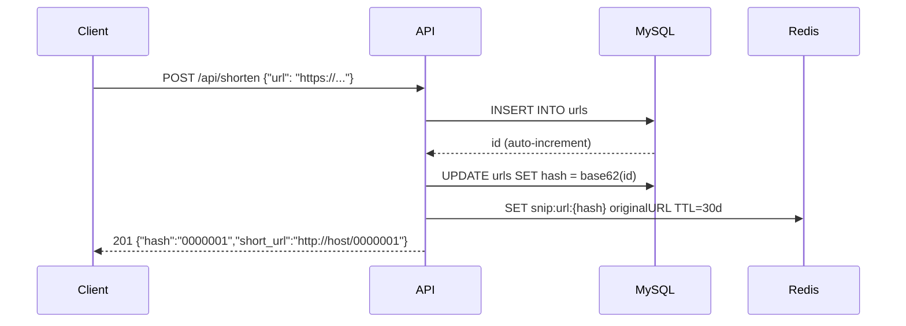
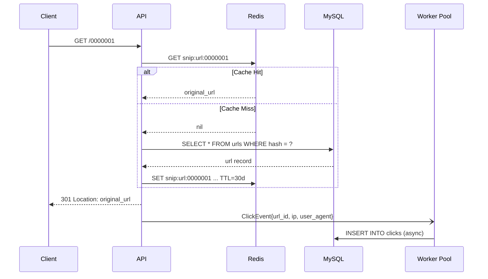
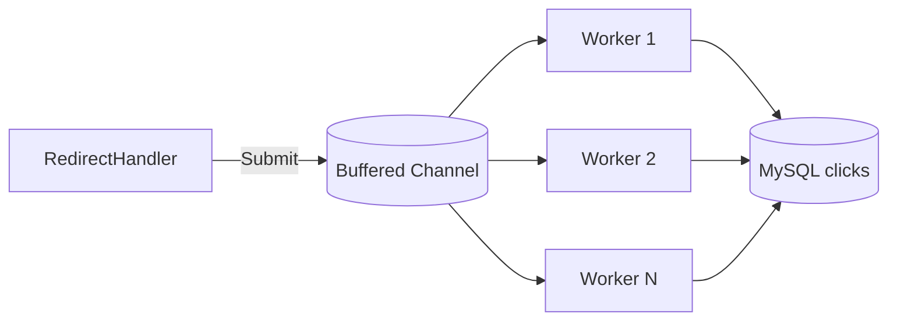

# ✂️ Snip

A production-ready URL shortener API built with Go, featuring Redis cache-aside, async analytics via goroutines, and graceful shutdown — designed as a high-concurrency microservice demonstration.


[](https://github.com/devpedrois/snip/actions/workflows/ci.yml)

---

## 📋 Table of Contents

- [About](#-about)
- [Architecture](#-architecture)
- [Stack](#-stack)
- [Prerequisites](#-prerequisites)
- [Getting Started](#-getting-started)
- [Testing](#-testing)
- [API Reference](#-api-reference)
- [Environment Variables](#-environment-variables)
- [Project Structure](#-project-structure)
- [Architecture Decisions](#-architecture-decisions)
- [Roadmap](#-roadmap)
- [Contributing](#-contributing)
- [License](#-license)

---

## 🎯 About

**Snip** demonstrates idiomatic Go patterns in a real-world scenario:

- Goroutines and channels for non-blocking analytics ingestion
- Cache-aside pattern with Redis in front of MySQL
- Context propagation from HTTP handler down to database layer
- Graceful shutdown draining in-flight events before exit
- Structured logging with `log/slog` (JSON in production, text in development)

The goal is a codebase that a new Go developer can read end-to-end and understand every decision.

---

## 🏗️ Architecture

### POST /api/shorten — Create Short URL



### GET /{hash} — Redirect



### Analytics — Async Click Ingestion



---

## 🛠️ Stack

| Layer | Technology |
|---|---|
| Language | Go 1.22+ |
| HTTP Router | `chi` v5 |
| Database | MySQL 8 |
| MySQL Driver | `go-sql-driver/mysql` |
| Migrations | `golang-migrate/migrate` |
| Cache | Redis 7 |
| Redis Client | `redis/go-redis` v9 |
| Logging | `log/slog` (stdlib) |
| Configuration | `joho/godotenv` + env vars |
| Testing | `testing` + `testify` |
| Integration Tests | `testcontainers-go` |
| Containerization | Docker + Docker Compose |

---

## 📦 Prerequisites

| Tool | Version | Purpose |
|---|---|---|
| Docker | 24+ | Run containers |
| Docker Compose | v2+ | Orchestrate services |
| Make | any | Run Makefile targets |
| Go | 1.22+ | Local development and tests |

---

## 🚀 Getting Started

### 1. Clone the repository

```bash
git clone https://github.com/devpedrois/snip.git
cd snip
```

### 2. Configure environment

```bash
cp .env.example .env
```

Defaults work out of the box for local development.

### 3. Start all services

```bash
make up
```

Builds the API image, starts MySQL 8 + Redis 7 + API, runs database migrations on startup, and waits for all healthchecks to pass.

### 4. Verify the stack is up

```bash
curl http://localhost:8080/health
# {"status":"ok","mysql":"up","redis":"up"}
```

### 5. Create a short URL

```bash
curl -s -X POST http://localhost:8080/api/shorten \
  -H "Content-Type: application/json" \
  -d '{"url": "https://github.com/devpedrois/snip"}' | jq
```

```json
{
  "hash": "0000001",
  "short_url": "http://localhost:8080/0000001"
}
```

### 6. Follow the redirect

```bash
curl -I http://localhost:8080/0000001
# HTTP/1.1 301 Moved Permanently
# Location: https://github.com/devpedrois/snip
```

### 7. View analytics

```bash
curl -s http://localhost:8080/api/analytics/0000001 | jq
```

```json
{
  "total_clicks": 1,
  "clicks_by_day": [{"date": "2026-05-03", "count": 1}],
  "top_user_agents": [{"user_agent": "curl/8.5.0", "count": 1}]
}
```

---

## 🧪 Testing

### Unit tests

```bash
make test
```

### Unit tests with race detector

```bash
make test-race
```

### Integration tests (requires Docker)

```bash
make test-integration
```

Integration tests spin up ephemeral MySQL and Redis containers via `testcontainers-go`, exercise the full HTTP stack, and tear everything down after.

### Coverage report

```bash
make coverage
# Prints total coverage % to terminal
# Generates coverage.html for detailed view
```

---

## 🔌 API Reference

### `POST /api/shorten`

Creates a shortened URL.

**Request:**

```bash
curl -X POST http://localhost:8080/api/shorten \
  -H "Content-Type: application/json" \
  -d '{"url": "https://example.com/some/long/path"}'
```

**Response — 201 Created:**

```json
{
  "hash": "0000001",
  "short_url": "http://localhost:8080/0000001"
}
```

**Error responses:**

| Status | Code | Reason |
|---|---|---|
| 400 | `ERR_INVALID_URL` | URL missing scheme or invalid host |
| 400 | `ERR_INVALID_BODY` | Malformed JSON body |
| 500 | `ERR_INTERNAL` | Database error |

---

### `GET /{hash}`

Redirects to the original URL.

**Request:**

```bash
curl -I http://localhost:8080/0000001
```

**Response — 301 Moved Permanently:**

```
Location: https://example.com/some/long/path
```

**Error responses:**

| Status | Code | Reason |
|---|---|---|
| 404 | `ERR_NOT_FOUND` | Hash does not exist |
| 410 | `ERR_URL_EXPIRED` | URL passed its expiration date |

---

### `GET /api/analytics/{hash}`

Returns click analytics for a short URL.

**Request:**

```bash
curl http://localhost:8080/api/analytics/0000001
```

**Response — 200 OK:**

```json
{
  "total_clicks": 42,
  "clicks_by_day": [
    {"date": "2026-05-01", "count": 20},
    {"date": "2026-05-02", "count": 22}
  ],
  "top_user_agents": [
    {"user_agent": "curl/8.5.0", "count": 30},
    {"user_agent": "Mozilla/5.0", "count": 12}
  ]
}
```

**Error responses:**

| Status | Code | Reason |
|---|---|---|
| 404 | `ERR_NOT_FOUND` | Hash does not exist |
| 500 | `ERR_INTERNAL` | Database error |

---

### `GET /health`

Reports the health of the API and its dependencies.

**Request:**

```bash
curl http://localhost:8080/health
```

**Response — 200 OK (all up):**

```json
{"status": "ok", "mysql": "up", "redis": "up"}
```

**Response — 503 Service Unavailable (degraded):**

```json
{"status": "degraded", "mysql": "down", "redis": "up"}
```

---

## ⚙️ Environment Variables

| Variable | Default | Description |
|---|---|---|
| `APP_PORT` | `8080` | HTTP server port |
| `APP_ENV` | `development` | `development` (text logs) or `production` (JSON logs) |
| `BASE_URL` | `http://localhost:8080` | Used to build `short_url` in responses |
| `MYSQL_HOST` | — | MySQL hostname (required) |
| `MYSQL_PORT` | `3306` | MySQL port |
| `MYSQL_USER` | — | MySQL username (required) |
| `MYSQL_PASSWORD` | — | MySQL password (required) |
| `MYSQL_DATABASE` | — | MySQL database name (required) |
| `MYSQL_MAX_OPEN_CONNS` | `25` | Max open connections in pool |
| `MYSQL_MAX_IDLE_CONNS` | `10` | Max idle connections in pool |
| `REDIS_HOST` | — | Redis hostname (required) |
| `REDIS_PORT` | `6379` | Redis port |
| `REDIS_PASSWORD` | `` | Redis AUTH password (empty = no auth) |
| `REDIS_DB` | `0` | Redis database index |
| `REDIS_TTL_DAYS` | `30` | Cache TTL in days |
| `ANALYTICS_WORKERS` | `4` | Goroutine pool size for click event consumption |
| `ANALYTICS_BUFFER` | `1000` | Buffered channel capacity for click events |
| `URL_EXPIRATION_DAYS` | `30` | Days before an idle URL expires |

---

## 📁 Project Structure

```
snip/
├── cmd/
│   ├── api/
│   │   └── main.go              # Entry point — wires dependencies and starts server
│   └── migrate/
│       └── main.go              # Standalone migration runner
├── internal/
│   ├── analytics/
│   │   ├── dispatcher.go        # Buffered channel + goroutine worker pool
│   │   └── event.go             # ClickEvent struct
│   ├── config/
│   │   └── config.go            # Env var loading with validation
│   ├── domain/
│   │   ├── url.go               # URL entity
│   │   ├── click.go             # Click entity
│   │   ├── analytics.go         # DailyCount / UserAgentCount value objects
│   │   └── errors.go            # Sentinel errors (ErrURLNotFound, ErrURLExpired)
│   ├── handler/
│   │   ├── shorten.go           # POST /api/shorten
│   │   ├── redirect.go          # GET /{hash}
│   │   ├── analytics.go         # GET /api/analytics/{hash}
│   │   ├── health.go            # GET /health — pings MySQL + Redis
│   │   └── dto.go               # Request/response types and JSON helpers
│   ├── hash/
│   │   ├── base62.go            # Encode/Decode — maps uint64 ID to 7-char hash
│   │   └── validator.go         # URL scheme and host validation
│   ├── middleware/
│   │   ├── logger.go            # Structured request logging (method, path, status, latency)
│   │   ├── requestid.go         # Injects X-Request-ID into context
│   │   └── recoverer.go         # Panic recovery
│   └── repository/
│       ├── mysql/
│       │   ├── connection.go    # Connection pool setup with PingContext
│       │   ├── url_repository.go
│       │   └── click_repository.go
│       └── redis/
│           ├── connection.go    # Redis client setup
│           └── cache.go         # URLCache — get/set with TTL
├── migrations/
│   ├── 000001_create_urls_table.up.sql
│   ├── 000001_create_urls_table.down.sql
│   ├── 000002_create_clicks_table.up.sql
│   └── 000002_create_clicks_table.down.sql
├── tests/
│   └── integration/             # testcontainers-go — real MySQL + Redis per test run
├── docker/
│   └── Dockerfile               # Multi-stage build, minimal final image
├── docker-compose.yml
├── Makefile
├── .env.example
└── go.mod
```

---

## 🧠 Architecture Decisions

- **`chi` over standard library mux** — URL parameter extraction (`{hash}`), middleware chaining, and route grouping without pulling in a full framework. Zero magic, idiomatic middleware interface.

- **Cache-aside over write-through** — The application controls cache population explicitly. On a cache miss the handler reads MySQL, then populates Redis. Redis failure never blocks a write — it degrades gracefully and the redirect still succeeds.

- **Async worker pool for analytics** — Click recording runs in a separate goroutine pool behind a buffered channel. The redirect response completes in roughly the time of a Redis GET, regardless of MySQL write latency. Dropped events are counted and logged rather than blocking callers.

- **Base62 offset encoding** — IDs start at 1. The offset `(id - 1)` in Base62 ensures the first URL maps to `0000001` (exactly 7 chars). `Decode` reverses the offset to recover the original `id`. Collision-free and deterministic without a separate hash computation or random generation.

- **`log/slog`** — Standard library structured logging added in Go 1.21. Zero external dependencies. JSON output in production, human-readable text in development. Every log entry carries `request_id` from middleware context, enabling distributed tracing without a full observability stack.

---

## 📈 Roadmap

- **Rate limiting** — Token bucket per IP on `POST /api/shorten` to prevent abuse
- **JWT authentication** — Auth layer so users can manage their own links
- **Prometheus metrics** — `snip_http_requests_total`, `snip_cache_hits_total`, dispatcher queue depth gauge
- **Analytics dashboard** — SSE feed of real-time click events per hash
- **Custom slugs** — Authenticated users choose a vanity path (e.g. `/my-brand`)

---

## 🤝 Contributing

1. Fork the repo and create your branch from `main`
2. Follow the branch naming convention: `feat/<slug>`, `fix/<slug>`, `docs/<slug>`
3. Follow Conventional Commits: `feat(scope): description`, `fix(scope): description`
4. Write or update tests for any changed code
5. Run `make fmt && make lint && make test` before opening a PR
6. Open a pull request against `main`

**Accepted commit types:** `feat`, `fix`, `docs`, `refactor`, `test`, `perf`, `build`, `ci`, `chore`

---

## 📄 License

This project is licensed under the [MIT License](LICENSE).
